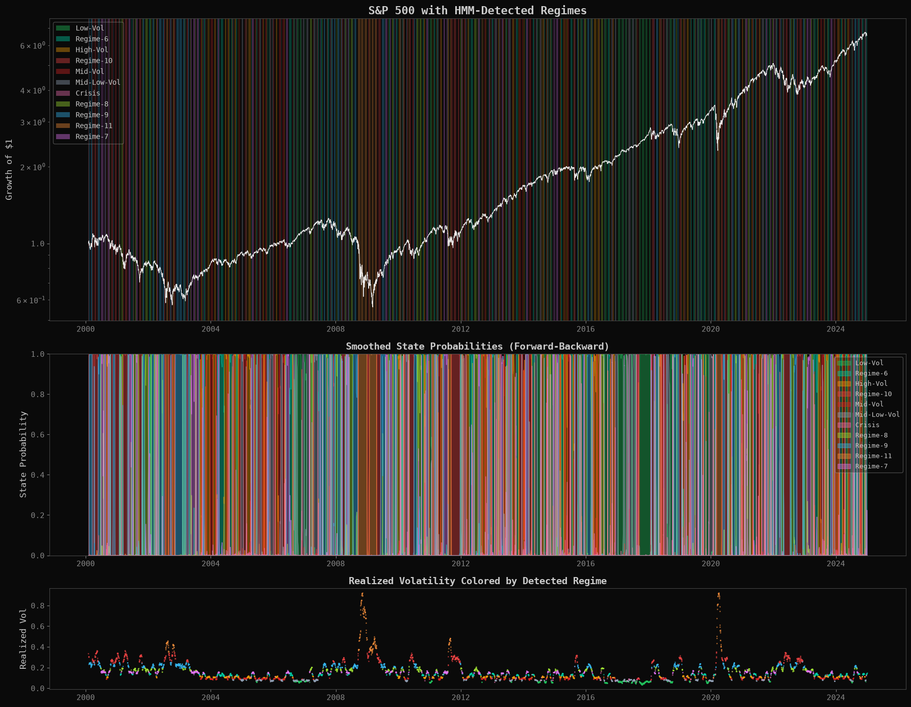
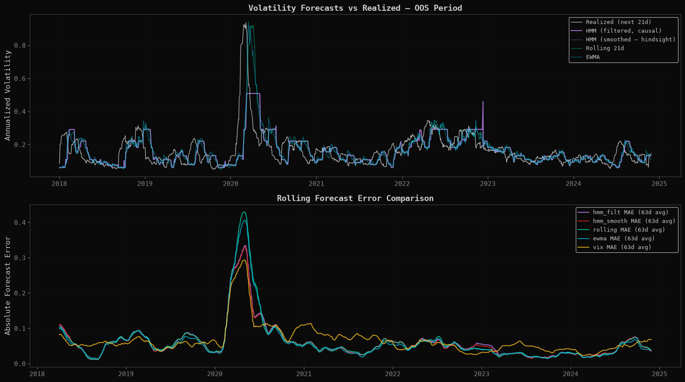

# HMM Regime Detection with Walk-Forward Allocation

**Hypothesis.** A Gaussian HMM on (return, realized vol, ΔVIX) can detect
market regimes early enough for a defensive-switching strategy to beat
buy-and-hold, and its regime-conditional vols should forecast volatility
better than causal benchmarks.

**Method.** hmmlearn EM with a hand-rolled, validated causal forward pass
([`common/hmm_filter.py`](common/hmm_filter.py) — exact hmmlearn
agreement at t = T; full Baum-Welch is the Phase 4 build), walk-forward
refits with window-local scaling and causal winsorization (delete-the-future
invariance machine-checked), 2000–2024. IS through 2017 / OOS 2018–2024.
Code: [`src/hmmlab/`](projects/03_hmm_regimes/src/hmmlab/).

**The honest headline: excellent detector, weak strategy — and a regime
count that Gaussian emissions cannot name.** As measurement, the HMM works:
GFC flagged at +4 days, COVID at +11, regimes matching known history. As a
strategy it loses to buy-and-hold OOS, **cited as a band, never a point**:
Sharpe 0.41 ± 0.06 [0.28, 0.48] across 8 EM seeds + 3 perturbations, vs
0.640 — the entire band below, and the single-run point sits at the band's
maximum. On "how many regimes does the market have": corrected BIC decreases
monotonically through K = 12 — **the count is unresolvable under Gaussian
emissions** (fat tails reward extra components indefinitely); the strategy's
K = 11 is a pre-stated elbow rule, labeled pragmatic. Vol forecasting:
VIX and EWMA beat the HMM causally — reported, not hidden.




Numbers: [`results/tables/p3_metrics.md`](results/tables/p3_metrics.md) ·
Limitations: [`docs/LIMITATIONS.md`](docs/LIMITATIONS.md) ·
Discipline: [`results/OOS_DISCIPLINE.md`](results/OOS_DISCIPLINE.md)

**Regenerate:**
```
jupyter nbconvert --to notebook --execute --inplace projects/03_hmm_regimes/notebooks/exploration.ipynb
```

---

## Repository layout

- [`projects/03_hmm_regimes/`](./projects/03_hmm_regimes/) — the project: [`notebooks/exploration.ipynb`](./projects/03_hmm_regimes/notebooks/exploration.ipynb) (the full narrative analysis, committed with outputs), `src/` (the extracted package), `config.yaml` (all parameters, schema-validated), `DESIGN.md` (the pre-registered spec), per-module tests.
- [`common/`](./common/) — shared library (data loading, metrics, causal HMM filter, plotting theme) used across the research program.
- [`tests/`](./tests/) — cross-cutting invariants: return-aggregation arithmetic, lookahead/leak detectors, cost-model parity.
- [`results/`](./results/) — citable figures and metric tables, the OOS discipline statement, the change log, and the full program report ([`QUANT_RESEARCH_GUIDE.pdf`](./results/QUANT_RESEARCH_GUIDE.pdf)).

## Setup

```
python -m venv .venv && source .venv/bin/activate
pip install -r requirements.lock
pip install -e ".[dev]"
pytest
```

Market data is downloaded on first notebook run and cached to `data/` (never committed).

## Part of a three-project research program

This repository is one of three companion projects sharing the `common/` library and the same IS/OOS discipline:

1. **Multi-Period Portfolio Optimization** — CVXPY, exact cost-model contract, the restraint result
2. **Eigenportfolios via Random Matrix Theory** — Marchenko-Pastur denoising, the five-probe tie
3. **HMM Regime Detection** — causal filtering, the detector/strategy split

*Author: David Colindres — M.S. Industrial & Systems Engineering + M.A. Econometrics, University of Oklahoma.*
